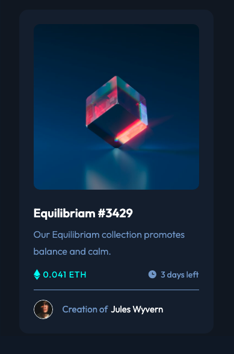

# Frontend Mentor - NFT preview card component solution

This is a solution to the [NFT preview card component challenge on Frontend Mentor](https://www.frontendmentor.io/challenges/nft-preview-card-component-SbdUL_w0U). Frontend Mentor challenges help you improve your coding skills by building realistic projects.

## Table of contents

- [Overview](#overview)
  - [Screenshot](#screenshot)
  - [Links](#links)
- [My process](#my-process)
  - [Built with](#built-with)
  - [What I learned](#what-i-learned)
  - [Continued development](#continued-development)
  - [Useful resources](#useful-resources)
- [Author](#author)

## Overview

-Create a card containing images and icons.

### Screenshot



### Links

- Solution URL: https://www.frontendmentor.io/solutions/newbie-challenge-completed-using-css-flexbox-R5T9MwN-87

- Live Site URL: https://fem-nft-component-card.netlify.app/

## My process

- Used Visual Studio Code, Figma and Firefox Developer Edition

### Built with

- Semantic HTML5 markup
- CSS custom properties
- CSS Flexbox

### What I learned

-In this project, pure CSS and flexbox were used. Flexbox is a one-dimensional layout system to make web design responsive, and it provides that the elements can change their behavior depending on the kind of device displaying them. Additionally, it makes elements flexible and provides them with appropriate position, and symmetry. Thus, responsive web pages are able to be designed and built without having to use a lot of float and position properties in the CSS.

# Interesting code

- Below is code to spread images and text horizontally

```html
<div class="flex-group">
  <div class="product__price">
    
    <p>0.041 ETH</p>
  </div>
  <div class="product__time">
    
    <p>3 days left</p>
  </div>
</div>
```

-Below is CSS to flex align all contents from top to bottom.

```css
.card {
  background-color: var(--primary-4);
  border-radius: 0.5rem;
  width: 327px;
  display: flex;
  flex-direction: column;
  justify-content: center;
  align-items: center;
}
```

### Continued development

I need to learn how to add an SVG image/icon to the centre of another image.

### Useful resources

- The following short video instructs how to add screenshots to VSC's README file. https://www.youtube.com/

## Author

- Frontend Mentor - [@John-Davidson-8](https://www.frontendmentor.io/profile/John-Davidson-8)
